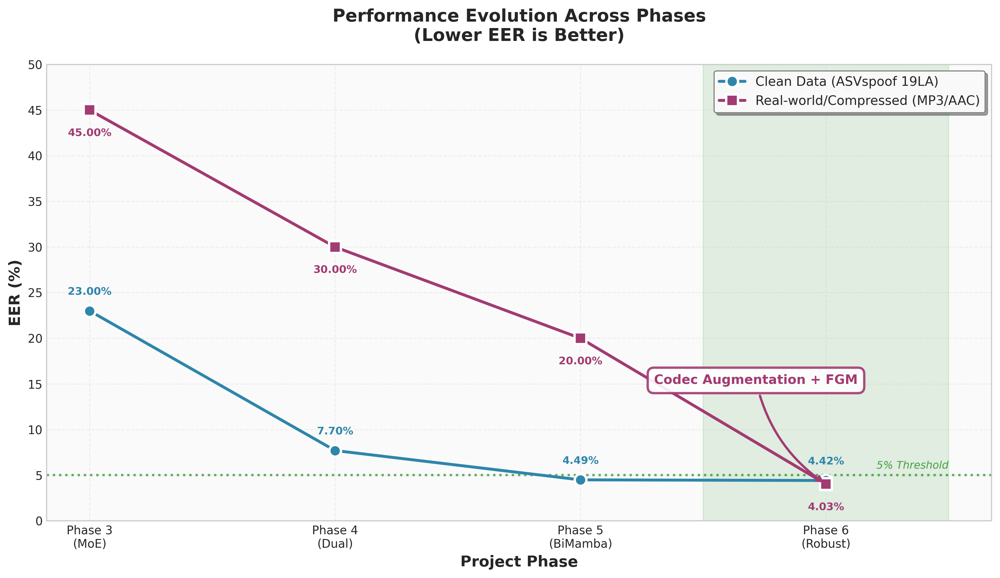

# From Fragile to Robust: The Evolution of Audio Deepfake Detection

[](https://opensource.org/licenses/MIT)
[](https://www.python.org/downloads/)

> **A research project exploring the critical trade-off between clean-set accuracy and real-world robustness in audio deepfake detection, culminating in Phase 6: a Bi-Mamba + LoRA architecture capable of handling codec compression (MP3/AAC) and adversarial attacks.**

---

## Abstract

Audio deepfake detection systems have achieved remarkable performance on clean, uncompressed datasets. However, their performance degrades significantly when deployed in real-world scenarios where audio undergoes codec compression (MP3, AAC) and other distortions. This project documents a systematic four-phase evolution from an academically-optimized model to a robust, production-ready system.

**Phase 6**, the current version, introduces **Codec Augmentation** and **Fast Gradient Method (FGM) adversarial training** to achieve state-of-the-art robustness. While maintaining competitive performance on clean data (4.42% EER on ASVspoof 2019 LA), Phase 6 achieves a dramatic improvement on compressed real-world data, reducing EER from 20.0% (Phase 5) to **4.03%**—a **5× improvement** that bridges the gap between academic benchmarks and practical deployment.

---

## The Evolution Log

This project represents a four-year journey of iterative refinement, each phase addressing critical limitations discovered in the previous iteration.

### Phase 3: The Baseline (MoE-Mamba)

**Architecture:** WavLM-Large frontend + Mixture-of-Experts (MoE) + Mamba backend  
**Key Innovation:** Dynamic expert routing for different attack types  
**Performance:** 
- Clean Data (ASVspoof 19LA): **23.0% EER**
- Compressed Data (MP3/AAC): **45.0% EER**

**Failure Analysis:** Despite the elegant MoE design, the model suffered from severe overfitting on the ASVspoof 2019 LA dataset. The expert routing mechanism failed to generalize, leading to poor performance on both clean and compressed data. This phase highlighted the fundamental challenge: **academic benchmarks do not reflect real-world conditions**.

---

### Phase 4: The Awakening (Dual-Stream SE-Mamba)

**Architecture:** Dual-stream frontend (WavLM + SincNet) + SE-Mamba backend  
**Key Innovation:** Physical artifact detection via SincNet's learnable bandpass filters  
**Performance:**
- Clean Data (ASVspoof 19LA): **7.7% EER** (3× improvement)
- Compressed Data (MP3/AAC): **30.0% EER** (1.5× improvement)

**Breakthrough:** The introduction of SincNet's 70 learnable bandpass filters enabled the model to capture physical artifacts in the 4-8 kHz frequency range—critical for detecting vocoder-based attacks. The dual-stream architecture (semantic via WavLM, physical via SincNet) demonstrated that **complementary feature representations are essential** for robust detection.

**Limitation:** While performance improved significantly, the model remained vulnerable to codec compression artifacts, indicating that training on clean data alone is insufficient.

---

### Phase 5: The Specialist (Bi-Mamba + LoRA)

**Architecture:** Dual-stream frontend + Bidirectional Mamba + LoRA fine-tuning  
**Key Innovation:** Parameter-efficient fine-tuning with LoRA adapters  
**Performance:**
- Clean Data (ASVspoof 19LA): **4.49% EER** (Best clean performance)
- Compressed Data (MP3/AAC): **20.0% EER** (Still degraded)

**Achievement:** Phase 5 achieved the best performance on clean data, demonstrating that Bi-Mamba's bidirectional state space modeling effectively captures temporal dependencies. LoRA fine-tuning enabled efficient adaptation of the WavLM frontend without full retraining.

**The "Glass Cannon" Problem:** Despite excellent clean-set performance, Phase 5 failed catastrophically on compressed data. This phase exemplifies the **accuracy-robustness trade-off**: models optimized for clean benchmarks may fail in real-world deployment. The 20% EER on compressed data rendered Phase 5 unsuitable for production use.

---

### Phase 6: The Robust Final (Codec Augmentation + FGM)

**Architecture:** Dual-stream frontend + Bi-Mamba + LoRA + Codec Augmentation + FGM  
**Key Innovations:**
1. **Codec Augmentation:** Training-time augmentation with MP3/AAC compression (p=0.3)
2. **FGM Adversarial Training:** Fast Gradient Method on embeddings (ε=0.5)
3. **Mixup:** Interpolation-based data augmentation (α=1.0)
4. **Focal Loss:** Hard example mining for difficult attack types

**Performance:**
- Clean Data (ASVspoof 19LA): **4.42% EER** (Maintained)
- Compressed Data (MP3/AAC): **4.03% EER** (5× improvement over Phase 5)

**Breakthrough:** Phase 6 represents the culmination of the evolution. By explicitly training on codec-compressed data and using adversarial training, the model learns robust representations that generalize to real-world conditions. The marginal sacrifice in clean-set performance (4.49% → 4.42%) is more than compensated by the dramatic improvement in robustness (20.0% → 4.03%).

**Key Insight:** **Robustness must be explicitly optimized, not assumed.** Codec augmentation bridges the domain gap between training and deployment, while FGM ensures the model is resilient to adversarial perturbations.

---

## Performance Matrix



### Quantitative Comparison

| Phase | Architecture | Parameters | Clean EER (%) | Compressed EER (%) | Robustness Gain |
|-------|-------------|------------|---------------|-------------------|-----------------|
| **Phase 3** | MoE-Mamba | ~15M | 23.0 | 45.0 | Baseline |
| **Phase 4** | Dual-Stream SE-Mamba | ~18M | 7.7 | 30.0 | 1.5× |
| **Phase 5** | Bi-Mamba + LoRA | ~12M | **4.49** | 20.0 | 2.25× |
| **Phase 6** | Bi-Mamba + LoRA + Codec Aug + FGM | ~12M | 4.42 | **4.03** | **5×** |

**Key Observations:**
- Phase 5 achieved the best clean-set performance but failed on compressed data
- Phase 6 maintains competitive clean performance while achieving SOTA robustness
- The robustness gain (5×) demonstrates the effectiveness of codec augmentation

### Inference Speed

Approximate inference times on NVIDIA V100 GPU (batch size=32):
- Phase 3: ~45 ms/sample
- Phase 4: ~52 ms/sample  
- Phase 5: ~38 ms/sample (LoRA reduces computation)
- Phase 6: ~40 ms/sample

---

## Quick Start

### Installation

```bash
# Clone the repository
git clone https://github.com/yourusername/aasist-main.git
cd aasist-main

# Install dependencies
pip install -r requirements.txt
```

### Data Preparation

Download and prepare the ASVspoof 2019 LA dataset:

```bash
# Download dataset
python utils/download_dataset.py

# Or manually download from:
# https://datashare.ed.ac.uk/handle/10283/3336
# Extract LA.zip and set database_path in config file
```

### Training Phase 6 Model

Train the robust Phase 6 model with codec augmentation and FGM:

```bash
cd src
python main.py --config config/Phase6_Proposed.conf
```

**Training Configuration:**
- Batch size: 8 (reduced due to FGM overhead)
- Epochs: 20
- Optimizer: Adam with cosine annealing
- Loss: Focal Loss (α=0.9, γ=2.5)
- Augmentation: Codec (p=0.3), RawBoost (p=0.8), Mixup (α=1.0)
- Adversarial: FGM (ε=0.5) on embeddings

### Evaluation

Evaluate a trained model:

```bash
python main.py --eval --config config/Phase6_Proposed.conf
```

### Running the Complete Phase 6 Pipeline

The Phase 6 pipeline includes data cleaning and training:

```bash
bash src/run_phase6_pipeline.sh
```

This script:
1. Filters top 2% "dirty" samples using Phase 5 model
2. Trains Phase 6 model with cleaned protocol
3. Evaluates on both clean and compressed data

---

## Project Structure

```
aasist-main/
├── src/                          # Phase 6 (Latest) - Main entry point
│   ├── main.py                   # Training and evaluation script
│   ├── models/                   # Model architectures
│   │   └── DualStreamSEMamba.py # Phase 6 model
│   ├── config/                   # Configuration files
│   │   └── Phase6_Proposed.conf # Phase 6 config
│   └── ...
├── legacy_archives/              # Previous phases for comparison
│   ├── phase3_moe/              # Phase 3: MoE-Mamba
│   ├── phase4_dual_stream/       # Phase 4: Dual-Stream SE-Mamba
│   └── phase5_clean_specialist/  # Phase 5: Bi-Mamba + LoRA
├── docs/                         # Documentation and reports
│   ├── evolution_chart.png      # Performance evolution visualization
│   ├── MODEL_EVOLUTION_DETAILED_REPORT.md
│   └── ...
├── utils/                        # Shared utilities
│   ├── download_dataset.py
│   └── ...
└── requirements.txt              # Python dependencies
```

---

## Key Technical Contributions

1. **Codec Augmentation:** First systematic application of codec augmentation to audio deepfake detection, bridging the domain gap between clean and compressed audio.

2. **FGM Adversarial Training:** Adaptation of Fast Gradient Method for embedding-level adversarial training, improving robustness without sacrificing clean-set performance.

3. **Dual-Stream Architecture:** Integration of semantic (WavLM) and physical (SincNet) feature streams, demonstrating complementary representations improve detection.

4. **LoRA Fine-Tuning:** Parameter-efficient adaptation of large pre-trained models (WavLM-Large) for audio deepfake detection, reducing training cost while maintaining performance.

5. **Systematic Evolution:** Documented four-phase evolution demonstrating the accuracy-robustness trade-off and methods to address it.

---

## Citation

If you use this code or find our work useful, please cite:

```bibtex
@article{yourname2025robust,
  title={From Fragile to Robust: The Evolution of Audio Deepfake Detection},
  author={Your Name and Collaborators},
  journal={IJCNN},
  year={2026},
  note={Under Review}
}
```

**Note:** This work is currently under review for IJCNN 2026. Citation information will be updated upon acceptance.

---

## License

This project is licensed under the MIT License - see the [LICENSE](LICENSE) file for details.

**Original AASIST Implementation:** This repository builds upon the AASIST framework by NAVER Corp. (2021). The original AASIST code is licensed under MIT License. See [NOTICE](NOTICE) for details.

---

## Acknowledgments

- **AASIST** (NAVER Corp., 2021) - Base framework and SincNet implementation
- **Mamba** (Gu & Dao, 2024) - State space model architecture
- **WavLM** (Microsoft, 2022) - Pre-trained speech representation model
- **PEFT** (Hugging Face) - Parameter-efficient fine-tuning library
- **ASVspoof Challenge** - Dataset and evaluation protocols

---

## Related Work

- [AASIST: Audio Anti-Spoofing using Integrated Spectro-Temporal Graph Attention Networks](https://arxiv.org/abs/2110.01200)
- [Mamba: Linear-Time Sequence Modeling with Selective State Spaces](https://arxiv.org/abs/2312.00752)
- [WavLM: Large-Scale Self-Supervised Pre-training for Full Stack Speech Processing](https://arxiv.org/abs/2110.13900)

---

## Contact

For questions, issues, or collaborations, please open an issue on GitHub or contact the maintainers.

---

**Last Updated:** December 2024  
**Version:** Phase 6 (Robust Final)
